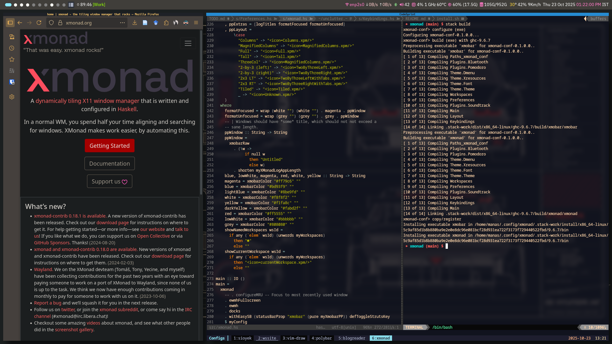

# XMonad Configuration



## Installation

```bash
$ mkdir -p $HOME/.config/xmonad
$ git clone https://github.com/weirdsmiley/xmonad $HOME/.config/xmonad/
$ cd $HOME/.config/xmonad
$ stack install
```

This will install the built `xmonad` and `xmobar` in `$HOME/.local/bin/`.

You know the drill for installing Xorg and other stuff to switch to XMonad
windows manager. Refer to any resources online.

You may also want to edit [Preferences.hs](https://github.com/weirdsmiley/xmonad/blob/main/src/Preferences.hs) accordingly.

## Thanks

I used [this](https://github.com/AtifChy/xmonad/) repository as my building block.
